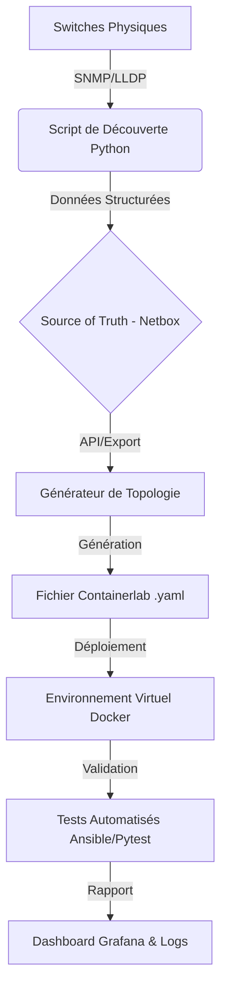

# 🌐 Network Digital Twin & Automation Pipeline

> **Projet d'Ingénierie DevOps & Réseau** : Automatisation complète de la simulation réseau (Jumeau Numérique) combinant monitoring temps réel et génération dynamique de topologies virtuelles.

---

## ⚠️ Avertissement de Confidentialité
*Ce projet a été développé dans un cadre professionnel. Le code présenté ici est une version **assainie et généralisée** (sanitized). Les données sensibles (topologies propriétaires, IPs internes, credentials) ont été retirées ou remplacées par des exemples génériques.*

---

## 📖 À propos du Projet

Ce projet répond à un besoin critique : **Comment tester des changements réseau complexes sans risquer de casser la production ?**

La solution développée permet de :
1.  **Scanner** le réseau physique existant (via LLDP/SNMP).
2.  **Générer** automatiquement un jumeau numérique fidèle (via Containerlab & Docker).
3.  **Simuler** des pannes et valider les configurations avant déploiement.

### 🎯 Impact Opérationnel
* **⚡ 80% de réduction** du temps de création d'environnements de test.
* **🛡️ 98% de fiabilité** sur les tests de pré-production.
* **🔄 Automatisation complète** du cycle de vie des tests réseau.

---

## 🏗️ Architecture du Pipeline

## 🛠️ Stack Technologique

Domaine,Technologies,Rôle dans le projet
Orchestration,"Containerlab, Docker",Déploiement des nœuds réseaux légers (conteneurs).
OS Réseau,"Arista cEOS, Linux (Alpine)",Images virtuelles simulant le comportement réel des routeurs.
Automatisation,"Python 3.x, Netmiko, NAPALM",Scripts de découverte (Discovery) et logique métier.
Config Mgmt,Ansible,Déploiement des configurations et compliance testing.
Source of Truth,Netbox,Inventaire centralisé et modèle de données (IPAM/DCIM).
Monitoring,"Grafana, Prometheus",Visualisation de l'état de santé du réseau simulé.
