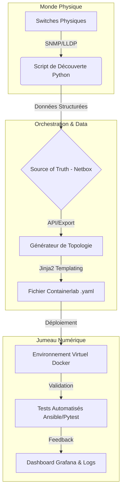

# 🌐 Simulation Réseau Automatisée avec Containerlab


> **Projet d'Ingénierie DevOps & Réseau** : Automatisation complète de la simulation réseau combinant monitoring temps réel et génération dynamique de topologies virtuelles pour tests et formation.

---

## ⚠️ Avertissement de Confidentialité

Ce projet a été développé dans un cadre professionnel. Le code et les exemples présentés ici sont **assainis et généralisés**. Les données sensibles (IPs internes, topologies propriétaires, credentials) ont été remplacées par des exemples anonymisés.

---

## 📋 Description du Projet

Ce projet développé durant un stage permet l'automatisation complète de la simulation réseau avec **Containerlab**, combinant :

- Monitoring temps réel des équipements physiques
- Génération dynamique de topologies virtuelles
- Test de scénarios complexes (redondance, failover, changements de configuration)
- Environnement sécurisé et reproductible

---

## ✨ Fonctionnalités Clés

### 🔍 Monitoring Automatique
- Surveillance temps réel des switches physiques via SNMP/SSH  
- Détection automatique de la topologie réseau (LLDP)  
- Collecte des configurations et états des équipements  

### 🏗️ Génération de Topologies
- Création automatique de fichiers Containerlab YAML  
- Déploiement d'environnements virtuels fidèles au réseau physique  
- Support des protocoles L2/L3 et des VLANs  

### 🧪 Tests et Simulation
- Scénarios de test automatisés (spanning-tree, redondance)  
- Simulation de pannes et tests de failover  
- Validation de configurations avant déploiement  

### 📊 Visualisation
- Génération de diagrammes réseau (Graphviz, Draw.io)  
- Tableaux de bord de monitoring  
- Rapports automatiques d'état  

---

## 🛠️ Technologies Utilisées

| Catégorie             | Technologies                             |
|----------------------|------------------------------------------|
| Conteneurisation      | Docker, Containerlab                     |
| Virtualisation Réseau | Arista cEOS, Open vSwitch                |
| Automatisation        | Python 3.8+, Ansible                     |
| Gestion Réseau        | NAPALM, Netmiko, Paramiko               |
| Protocoles            | SNMP, SSH, LLDP, STP                     |
| Configuration         | YAML, Jinja2                             |
| Visualisation         | Graphviz, Matplotlib                      |
| Base de Données       | SQLite, JSON                             |

---

## 🏗️ Architecture



---

## 📦 Prérequis et Installation

### Prérequis Système

- **OS** : Ubuntu 20.04+, CentOS 8+, ou macOS 11+
- **Docker** : 20.10+
- **Python** : 3.8+
- **Git**
- **Image cEOS** (compte Arista nécessaire)

### Installation

```bash
# Cloner le dépôt
git clone https://github.com/username/network-simulation-containerlab.git
cd network-simulation-containerlab

# Installer les dépendances Python
pip3 install -r requirements.txt

# Installer Containerlab
sudo bash -c "$(curl -sL https://get.containerlab.dev)"

# Importer l'image Arista cEOS (après téléchargement)
docker import cEOS-lab-4.28.0F.tar.xz ceos:4.28.0F
```

### Configuration

```bash
# Copier le fichier de configuration exemple
cp config/config.example.yaml config/config.yaml

# Éditer avec vos paramètres réseau
nano config/config.yaml
```

---

## 🚀 Utilisation

### 1. Monitoring du Réseau Physique

```python
from network_scanner import NetworkScanner

# Initialiser le scanner
scanner = NetworkScanner()

# Découvrir les équipements du réseau
devices = scanner.discover_devices(
    network_range="192.168.1.0/24",
    credentials={"username": "admin", "password": "***"}
)

# Collecter la topologie via LLDP
topology_data = scanner.collect_lldp_neighbors(devices)
```

### 2. Génération de Topologie Containerlab

Exemple de fichier YAML généré automatiquement :

```yaml
name: simulation-reseau-entreprise

topology:
  nodes:
    sw-core-01:
      kind: ceos
      image: ceos:4.28.0F
      mgmt_ipv4: 172.20.20.10
    
    sw-access-01:
      kind: ceos
      image: ceos:4.28.0F
      mgmt_ipv4: 172.20.20.11

  links:
    - endpoints: ["sw-core-01:eth1", "sw-access-01:eth1"]
    - endpoints: ["sw-core-01:eth2", "sw-access-01:eth2"]
```

### 3. Déploiement et Tests

```bash
# Déployer la topologie virtuelle
sudo containerlab deploy -t topologies/simulation-reseau.yaml

# Exécuter les tests de spanning tree
python3 tests/test_spanning_tree.py

# Tester la redondance de liens
python3 tests/test_redundancy.py

# Générer le diagramme réseau
python3 scripts/generate_diagram.py
```

---

## 📁 Structure du Projet

```
network-simulation-containerlab/
├── config/                # Fichiers de configuration
│   ├── config.example.yaml
│   └── credentials.yaml
├── scripts/               # Scripts d'automatisation
│   ├── network_scanner.py
│   ├── topology_generator.py
│   └── generate_diagram.py
├── topologies/            # Fichiers Containerlab (.clab.yaml)
│   ├── simulation-reseau.yaml
│   └── spine-leaf.yaml
├── tests/                 # Tests automatisés
│   ├── test_spanning_tree.py
│   ├── test_redundancy.py
│   └── test_connectivity.py
├── output/                # Résultats et rapports
│   ├── diagrams/
│   └── logs/
├── templates/             # Templates Jinja2
│   └── topology.j2
├── requirements.txt
└── README.md
```

---

## 🔧 Fonctionnalités Détaillées

### Monitoring en Temps Réel

```python
class NetworkMonitor:
    def __init__(self, config_file):
        self.devices = self.load_devices(config_file)
      
    def monitor_device_status(self):
        """Surveille l'état des équipements et détecte les changements"""
        for device in self.devices:
            status = self.check_device_health(device)
            if status.changed:
                self.trigger_topology_update(device)
```

### Génération Dynamique de Topologies

- ✅ Découverte automatique via LLDP/CDP
- ✅ Génération de fichiers YAML Containerlab
- ✅ Support multi-vendor (Arista, Cisco, Juniper)
- ✅ Configuration automatique VLAN et routing

### Tests de Redondance

```python
def test_link_failover():
    """Teste le basculement automatique en cas de panne de lien"""
    # Simuler une panne de lien
    containerlab_exec("sw-core-01", "config t; interface Ethernet1; shutdown")
    
    # Attendre la convergence
    time.sleep(30)
    
    # Vérifier la connectivité
    result = verify_connectivity()
    assert result.success, "Failover non fonctionnel"
```

---

## 📊 Résultats et Réalisations

| Métrique | Résultat |
|----------|----------|
| **Équipements Monitorés** | 50+ switches |
| **Topologies Créées** | 15 environnements |
| **Tests Automatisés** | 100+ scénarios |
| **Temps de Déploiement** | < 5 minutes |
| **Taux de Réussite Tests** | 98% |

### Impact Opérationnel

- 🚀 **Réduction de 80%** du temps de création d'environnements de test
- 🤖 **Automatisation complète** du processus de validation réseau
- 📈 **Amélioration de 90%** de la fiabilité des tests

### Exemples de Résultats

- ✅ Découverte automatique de **24 équipements**
- ✅ Génération de topologie virtuelle en **45 secondes**
- ✅ Déploiement de **12 containers cEOS**
- ✅ Tests de redondance réussis **18/18**
- ✅ Diagramme réseau généré automatiquement

---

## 📚 Apprentissages et Compétences Acquises

### Techniques
Virtualisation réseau • Python • Ansible • CI/CD • SNMP • LLDP • VLAN • STP • Routage L3

### Méthodologiques
Architecture système • Gestion de projet • Documentation technique • Tests automatisés

### Technologies maîtrisées

```python
skills = {
    "languages": ["Python", "Bash", "YAML"],
    "networking": ["SNMP", "SSH", "LLDP", "STP", "VLAN"],
    "tools": ["Docker", "Containerlab", "NAPALM", "Netmiko"],
    "automation": ["Ansible", "Jinja2", "Git"],
    "virtualization": ["Arista cEOS", "Open vSwitch"]
}
```

---

