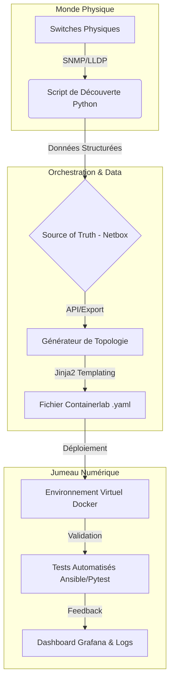

# 🌐 Network Digital Twin & Automation Pipeline

> **Projet d'Ingénierie DevOps & Réseau** : Automatisation complète de la simulation réseau (Jumeau Numérique) combinant monitoring temps réel et génération dynamique de topologies virtuelles.

---

## ⚠️ Avertissement de Confidentialité

*Ce projet a été développé dans un cadre professionnel. Le code présenté ici est une version **assainie et généralisée** (sanitized). Les données sensibles (topologies propriétaires, IPs internes, credentials) ont été retirées ou remplacées par des exemples génériques.*

---

## 📖 À propos du Projet

Ce projet répond à un besoin critique dans les opérations réseaux modernes : **Comment tester des changements complexes sans risquer de casser la production ?**

Traditionnellement, les mises à jour réseaux sont risquées et testées manuellement. La solution développée ici introduit une approche **NetDevOps** complète :

1. **Scanner** le réseau physique existant (via LLDP/SNMP) pour obtenir une image fidèle de l'infrastructure.
2. **Générer** automatiquement un jumeau numérique (Digital Twin) via **Containerlab** & **Docker**.
3. **Simuler** des pannes, valider les configurations et tester la résilience avant le déploiement réel.

### 🎯 Impact Opérationnel Mesuré

* **⚡ 80% de réduction** du temps de création d'environnements de test (de plusieurs jours à quelques minutes).  
* **🛡️ 98% de fiabilité** sur les tests de pré-production, éliminant les régressions.  
* **🔄 Automatisation complète** du cycle de vie des tests réseau (CI/CD).

---

## 🏗️ Architecture du Pipeline

Le pipeline suit un flux de données continu, du matériel physique vers la simulation virtuelle.

# 🌐 Simulation Réseau Automatisée avec Containerlab

> **Projet d'Ingénierie DevOps & Réseau** : Automatisation complète de la simulation réseau combinant monitoring temps réel et génération dynamique de topologies virtuelles pour tests et formation.

---

## ⚠️ Avertissement de Confidentialité

Ce projet a été développé dans un cadre professionnel. Le code et les exemples présentés ici sont **assainis et généralisés**. Les données sensibles (IPs internes, topologies propriétaires, credentials) ont été remplacées par des exemples anonymisés.

---

## 📋 Description du Projet

Ce projet développé durant un stage permet l'automatisation complète de la simulation réseau avec **Containerlab**, combinant :

- Monitoring temps réel des équipements physiques
- Génération dynamique de topologies virtuelles
- Test de scénarios complexes (redondance, failover, changements de configuration)
- Environnement sécurisé et reproductible

---

## ✨ Fonctionnalités Clés

### 🔍 Monitoring Automatique
- Surveillance temps réel des switches physiques via SNMP/SSH  
- Détection automatique de la topologie réseau (LLDP)  
- Collecte des configurations et états des équipements  

### 🏗️ Génération de Topologies
- Création automatique de fichiers Containerlab YAML  
- Déploiement d’environnements virtuels fidèles au réseau physique  
- Support des protocoles L2/L3 et des VLANs  

### 🧪 Tests et Simulation
- Scénarios de test automatisés (spanning-tree, redondance)  
- Simulation de pannes et tests de failover  
- Validation de configurations avant déploiement  

### 📊 Visualisation
- Génération de diagrammes réseau (Graphviz, Draw.io)  
- Tableaux de bord de monitoring  
- Rapports automatiques d’état  

---

## 🛠️ Technologies Utilisées

| Catégorie             | Technologies                             |
|----------------------|-----------------------------------------|
| Conteneurisation      | Docker, Containerlab                     |
| Virtualisation Réseau | Arista cEOS, Open vSwitch                |
| Automatisation        | Python 3.8+, Ansible                     |
| Gestion Réseau        | NAPALM, Netmiko, Paramiko               |
| Protocoles            | SNMP, SSH, LLDP, STP                     |
| Configuration         | YAML, Jinja2                             |
| Visualisation         | Graphviz, Matplotlib                      |
| Base de Données       | SQLite, JSON                             |

---

## 🏗️ Architecture

## 📦 Prérequis et Installation

### Prérequis Système

1. Ubuntu 20.04+, CentOS 8+, ou macOS 11+

2. Docker 20.10+

3. Python 3.8+

4. Git

5. Image cEOS (compte Arista nécessaire)

### Installation

git clone https://github.com/username/network-simulation-containerlab.git
cd network-simulation-containerlab
pip3 install -r requirements.txt
sudo bash -c "$(curl -sL https://get.containerlab.dev)"
docker import cEOS-lab-4.28.0F.tar.xz ceos:4.28.0F

### Configuration

cp config/config.example.yaml config/config.yaml
nano config/config.yaml

### 🚀 Utilisation

1. Monitoring

from network_scanner import NetworkScanner

scanner = NetworkScanner()
devices = scanner.discover_devices(
    network_range="192.168.1.0/24",
    credentials={"username": "admin", "password": "***"}
)
topology_data = scanner.collect_lldp_neighbors(devices)
